# Полнофункциональный интернет-магазин на Django с интеграцией платежной системы Stripe.


## 📸 Скриншоты

| Главная страница | Детальная страница товара |
|:----------------:|:-------------------------:|
| 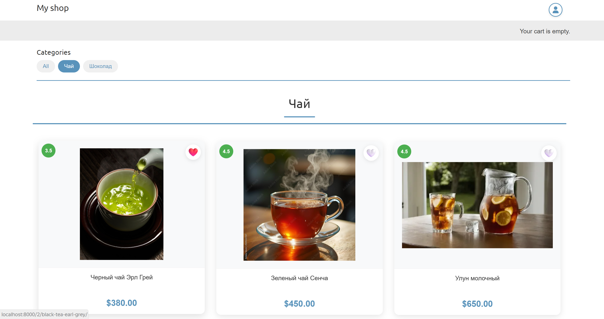 | 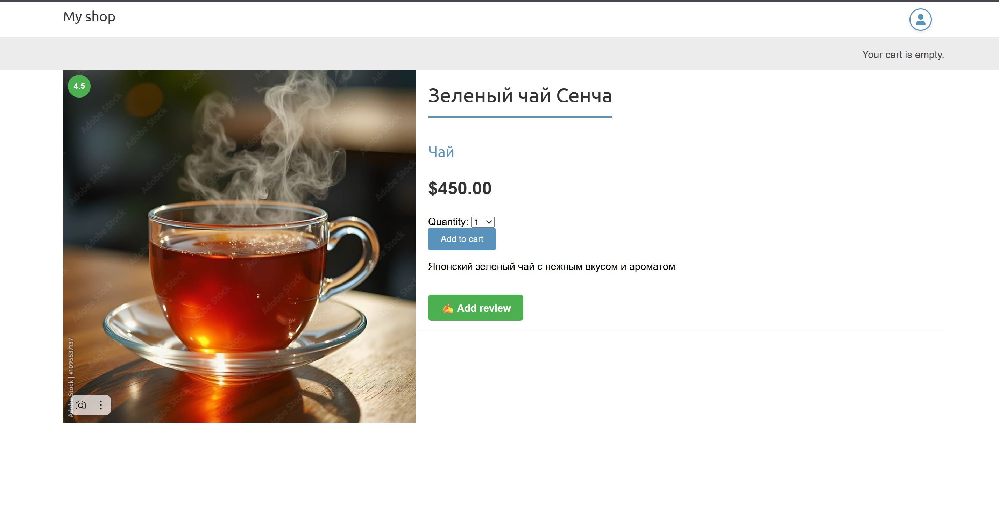 |

| Корзина покупок | Оформление заказа |
|:---------------:|:-----------------:|
| 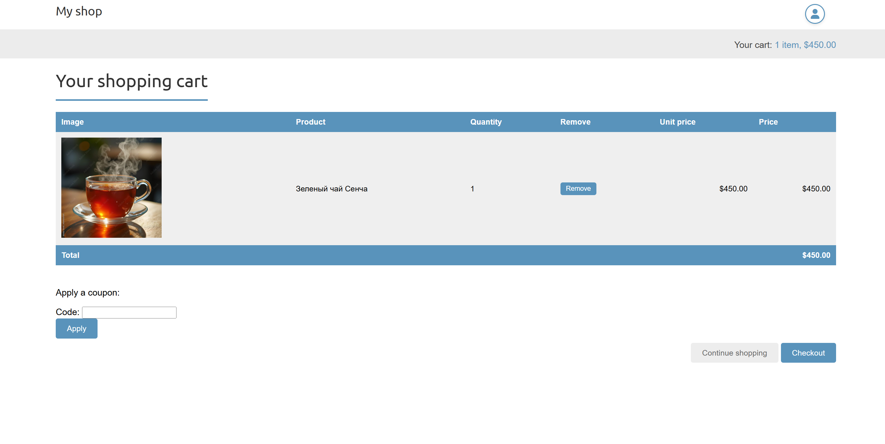 | 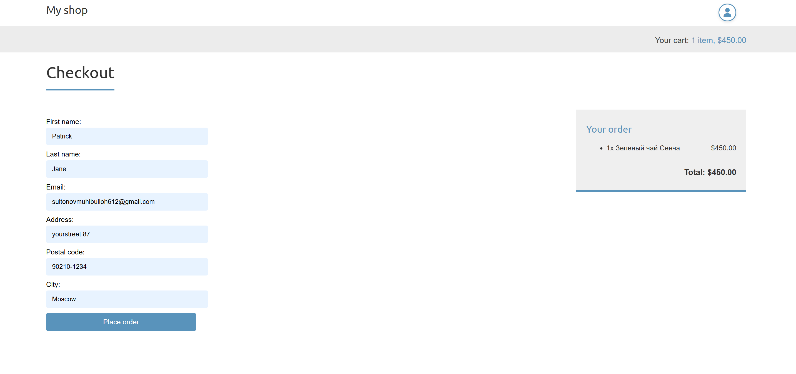 |

| Платежная система | PDF-чек |
|:-----------------:|:-------:|
| 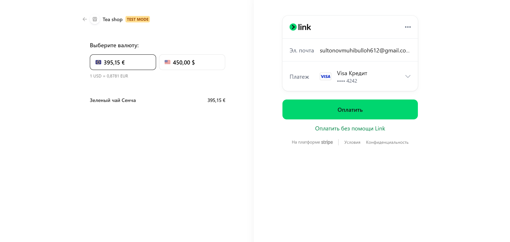 | 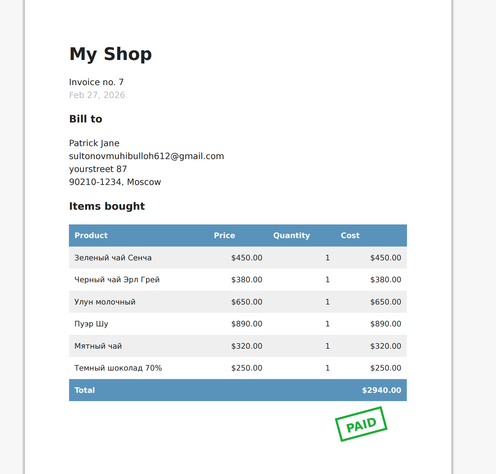 |

| Система отзывов | Админ-панель закзов |
|:---------------:|:------------:|
| 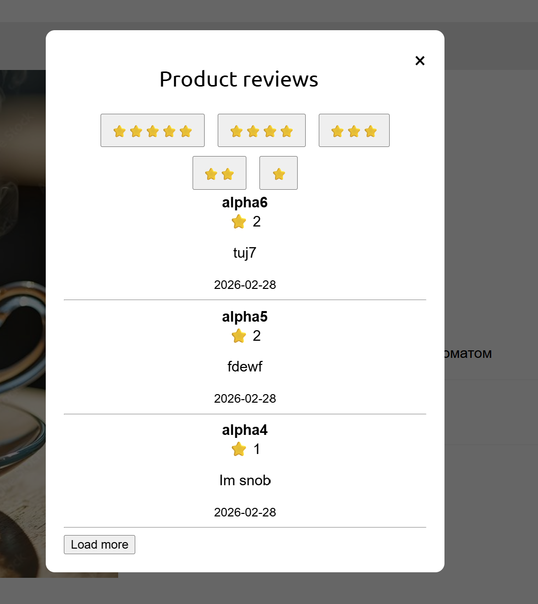 | 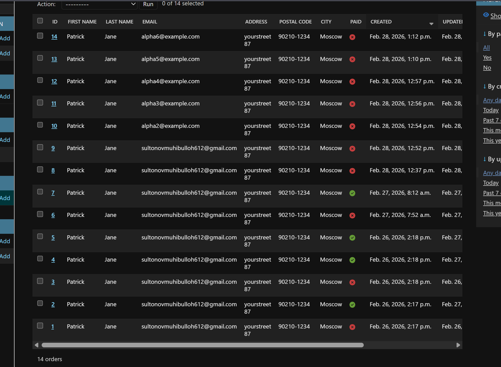 |

| Управление заказами | Детали заказа в админке |
|:-------------------:|:-----------------------:|
| 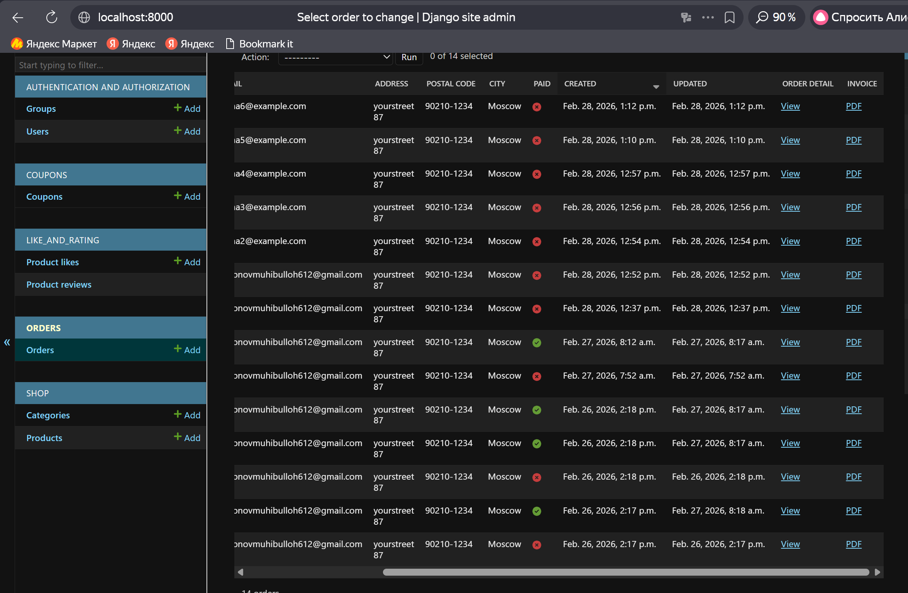 | 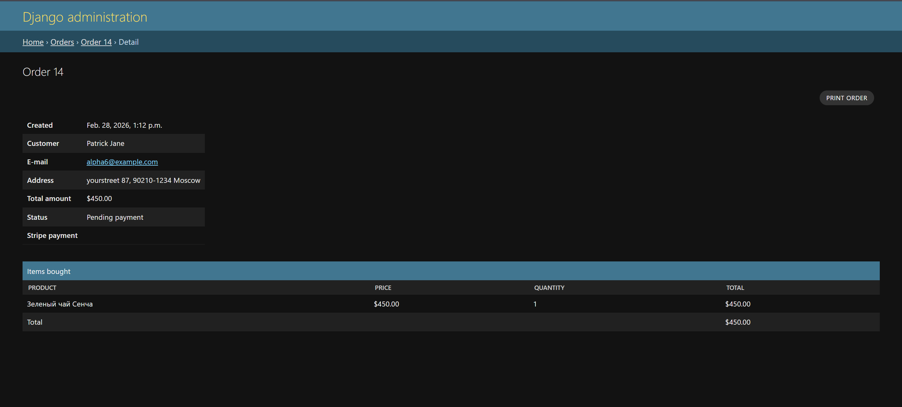 |

## ✨ Ключевые возможности

### Для покупателей
- 🔐 **Регистрация и аутентификация** (стандартная Django-регистрация)
- 📦 **Каталог товаров** с фильтрацией по категориям 
- 🛒 **Корзина** на Django Sessions (можно добавить/удалить товары, изменить количество)
- 💳 **Интеграция со Stripe** — безопасная оплата банковскими картами
- ⭐ **Система рейтингов** — оценка товаров от 1 до 5 звезд
- 💬 **Отзывы** — текстовые комментарии к товарам
- ❤️ **Лайки** — добавление товаров в избранное
- 🎯 **Рекомендации** —  система подбора товаров на основе купленных товаров вместе 
- ✉️ **Автоматические email-уведомления** — при создании заказа и успешной оплате клиент получает письмо с **PDF-чеком** — (генерация через WeasyPrint)
- 🏷️ **Купони** — купонная система для скидок
- 🔄 **Бесконечная прокрутка** — для удобного просмотра товаров
- 📊 **средная оценка** — отображение средней оценки на карточке товара  


### Технические особенности
- 🔄 **Webhook Stripe** — обработка асинхронных событий об оплате. Когда платеж успешно проходит, Stripe отправляет webhook, и статус заказа автоматически меняется на "оплачен".
- 🐳 **Полная контейнеризация** — проект запускается одной командой `docker-compose up`
- 🗄️ **PostgreSQL** — основная база данных
- 📊 **Кастомная админка** — удобное управление товарами, заказами и отзывами. Возможность скачать информацию о заказе в формате pdf и удобный интерфейс для просмотра информации о заказе
- 📥 **Экспорт заказов в CSV** — администратор может выгружать данные о заказах для анализа


## 🛠 Технологический стек

| Компонент | Технология |
|-----------|------------|
| **Backend** | Python 3.12, Django 6.0.1 |
| **База данных** | PostgreSQL|
| **Брокер сообщений** | RabbitMQ |
| **Кэширование** | Redis |
| **Фоновые задачи** | Celery |
| **Платежи** | Stripe API + Webhooks |
| **Контейнеризация** | Docker, Docker Compose |
| **Фронтенд** | HTML, CSS, Bootstrap, JavaScript (AJAX для лайков, асинхронная добавление отзывов в окно для просмотро без перезагрузки всей страницы) |
| **Веб-сервер** | Nginx (отдача статики и медиа) |


### Компоненты
- **Celery** — распределенная очередь задач
- **RabbitMQ** — брокер сообщений (передает задачи от Django к Celery)
- **Redis** — используется для для формерование рекомендации на основе оплаченных заказов

### Какие задачи выполняются асинхронно через Celery

| Задача | Зачем асинхронно | Триггер |
|--------|------------------|---------|
| 📧 **Отправка email-уведомлений** | Не заставлять пользователя ждать | После создания заказа, после оплаты |
| 💰 **Обновление статуса заказа** | Webhook от Stripe может прийти с задержкой, не блокировать пользователя | Получение события `checkout.session.completed` от Stripe |


### Предварительные требования

- Установите [Docker](https://www.docker.com/products/docker-desktop/)
- Установите [Git](https://git-scm.com/)
- Зарегистрируйтесь в [Stripe](https://stripe.com) (для получения ключей)
- Настройте отправку email-уведомлений (инструкция ниже)

---

#### Вариант 1: SMTP-сервер Gmail (только для разработки)

> ⚠️ **Важно:** Этот способ подходит **только для разработки и тестирования**. Для продакшена используйте профессиональные почтовые сервисы (SendGrid, Amazon SES и т.д.).


**Шаг 1. Создайте пароль приложения в Google:**

Google использует двухэтапную аутентификацию, поэтому обычный пароль от Gmail не подойдет. Вам нужно создать специальный пароль приложения:

Перейдите в Настройки безопасности Google

В разделе "Вход в Google" выберите "Двухэтапная аутентификация" и включите её (если еще не включена)

После включения двухэтапной аутентификации в том же разделе появится пункт "Пароли приложений" — нажмите на него или перейдите по ссылке:
https://myaccount.google.com/apppasswords

В выпадающем списке "Выберите приложение" укажите "Другое"

Введите название (например, "Django Shop") и нажмите "СГЕНЕРИРОВАТЬ"

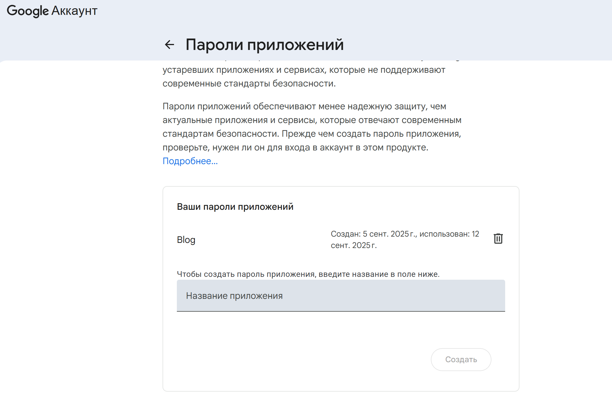

Google сгенерирует 16-значный пароль (выглядит так: xxxx xxxx xxxx xxxx)
Скопируйте этот пароль и вставьте в поле EMAIL_HOST_PASSWORD в файле .env

**Шаг 2. Настройте параметры в файле `.env` (который находится в главной папке проекта):**

```env
# Конфигурация email (Gmail)
EMAIL_HOST=smtp.gmail.com
EMAIL_PORT=587
EMAIL_HOST_USER=your_account@gmail.com
EMAIL_HOST_PASSWORD=your_app_password
EMAIL_USE_TLS=True
```

⚠️ Важно: Пароль приложения показывается только один раз. Сохраните его в безопасном месте.
### 💳 Создание учетной записи Stripe
> ⚠️ **Важно:** Так как платформа Stripe не работает в России, для регистрации и тестирование  вам  понадобиться VPN. Самый простой способ — использовать браузер с встроенным VPN (например, Opera) или расширение для Chrome (например, Windscribe). 


Для интеграции платежного шлюза в проект понадобится учетная запись Stripe. Давайте создадим учетную запись, чтобы протестировать API Stripe.

#### Шаг 1. Регистрация в Stripe

1. Пройдите по URL-адресу [https://dashboard.stripe.com/register]в своем браузере

2. Заполните регистрационную форму своими данными:
   - Email
   - Полное имя
   - Пароль

   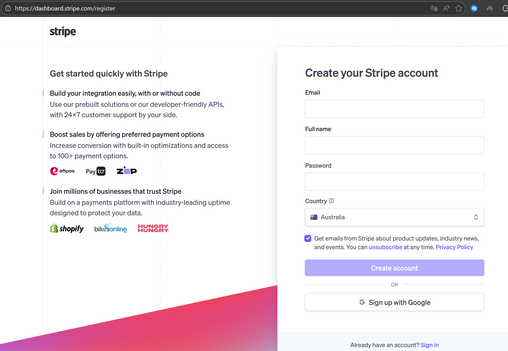

3. Нажмите **"Create account"** (Создать учетную запись)

#### Шаг 2. Подтверждение email

Stripe отправит письмо для подтверждения вашего адреса электронной почты:


1. Откройте письмо в папке входящих сообщений
2. Нажмите **"Verify email address"** (Подтвердить адрес электронной почты)

#### Шаг 3. Настройка тестовой среды

После подтверждения вы попадете на информационную панель Stripe:


В правом верхнем углу вы увидите переключатель **"Test mode"** (Тестовый режим) — он должен быть активен. Stripe предоставляет тестовую и производственную среды. Для разработки и тестирования мы будем использовать **тестовый режим**.

#### Шаг 4. Настройка имени учетной записи

1. Перейдите в [https://dashboard.stripe.com/settings/account](https://dashboard.stripe.com/settings/account)
2. В разделе **"Account name"** (Имя учетной записи) введите название (например, "Django Shop")
3. Нажмите **"Save"** (Сохранить)

#### Шаг 5. Получение API ключей

1. Перейдите в раздел API ключей: [https://dashboard.stripe.com/test/apikeys](https://dashboard.stripe.com/test/apikeys)
   
   Или через меню: **Developers** → **API keys**

   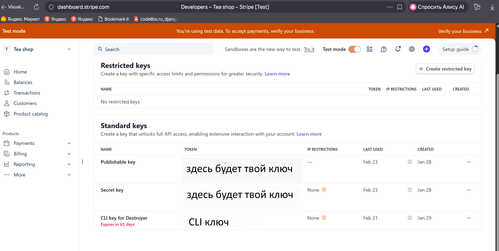

2. Stripe предоставляет две пары ключей для разных сред:

   | Среда | Публикуемый ключ (Publishable key) | Секретный ключ (Secret key) |
   |-------|-----------------------------------|----------------------------|
   | **Тестовая** | `pk_test_...` | `sk_test_...` |
   | **Производственная** | `pk_live_...` | `sk_live_...` |

3. Скопируйте ключи из тестового режима:
   - **Публикуемый ключ** (Publishable key) — можно использовать в клиентском коде
   - **Секретный ключ** (Secret key) — храните в секрете, используйте только на сервере

> ⚠️ **Важно:** Секретный ключ нельзя публиковать в открытом доступе или коммитить в Git!

#### Шаг 6. Добавление ключей в проект Django

**Вариант А: Для разработки (через .env файл)**

Добавьте в файл `.env` (который находится в главной папке проекта):

```env
# Stripe (тестовые ключи)
STRIPE_PUBLISHABLE_KEY=pk_test_51XXXXXXXXXXXXXX
STRIPE_SECRET_KEY=sk_test_XXXXXXXXXXXXXXXXXX
STRIPE_API_VERSION=2022-08-01
```
#### 🧪 Тестовые карты Stripe

Для тестирования платежей используйте эти карты (тестовый режим):

| Результат | Номер карты |
|-----------|-------------|
| ✅ Успешный платеж | `4242 4242 4242 4242` |
| ❌ Неуспешный платеж | `4000 0000 0000 0002` |
| 🔐 3D Secure | `4000 0025 0000 3155` |

**Правила заполнения:**
- **CVC:** любые 3 цифры
- **Дата:** любая будущая дата (например, 12/34)

[Документация Stripe по тестированию](https://stripe.com/docs/testing)

#### 🧪 Тестирование веб-перехватчиков (Webhooks) Stripe

Для тестирования веб-перехватчиков в режиме разработки необходимо установить интерфейс командной строки Stripe (CLI). Это инструмент разработчика, который позволяет тестировать и управлять интеграцией с Stripe прямо из командной оболочки.

##### Установка Stripe CLI

**Инструкция по установке:** [https://docs.stripe.com/stripe-cli/install](https://docs.stripe.com/stripe-cli/install)

**Вариант 1: Установка через Homebrew (macOS/Linux)**


```
# bash
brew install stripe/stripe-cli/stripe

```

**Вариант 2: Установка на Windows или Linux без Homebrew**

Скачайте последнюю версию Stripe CLI для вашей ОС:

https://github.com/stripe/stripe-cli/releases/latest

Распакуйте скачанный архив

Для Windows запустите распакованный файл .exe

Аутентификация Stripe CLI
После установки выполните команду для входа в свою учетную запись Stripe:
```
# bash
stripe login
```
Вы увидите примерно такой результат:
```
Your pairing code is: xxxx-yyyy-zzzz-oooo
This pairing code verifies your authentication with Stripe.
Press Enter to open the browser or visit https://dashboard.stripe.com/stripecli/confirm_auth?t=....
```
Что делать:

Нажмите клавишу Enter (откроется браузер)

Либо вручную перейдите по URL-адресу из терминала

В браузере вы увидите экран сопряжения.


Проверьте, чтобы код сопряжения в терминале совпадал с кодом на сайте

Нажмите "Allow access" (Разрешить доступ)

После успешного сопряжения вы увидите подтверждение:

**Шаг 6. Получение секрета веб-перехватчика**

Теперь запустите прослушивание событий Stripe и их пересылку на ваш локальный сервер Django:

```
# bash
stripe listen --forward-to http://localhost:8000/payment/webhook/
```
💡 Пояснение:

localhost:8000 — порт, на котором работает сервер разработки Django

/payment/webhook/ — URL-путь, который обрабатывает веб-перехватчики (должен совпадать с вашим urls.py)

Вы увидите результат:

```
Getting ready... > Ready! You are using Stripe API Version [2022-08-01]. Your webhook signing secret is whsec_xxxxxxxxxxxxxxxxxxx (^C to quit)
```
В выводе команды вы видите секрет подписи веб-перехватчика (начинается с whsec_). Этот секрет нужно добавить в настройки проекта .env.
```env
STRIPE_WEBHOOK_SECRET=whsec_xxxxxxxxxxxxxxxxxxx
```


## 🚀 Запуск
**Данные**
В БД есть данные для тестирования. При сбоке контейнера или при локальном запуске в базу данных будут загружены тестовые товары, категории. Вы можете использовать эти данные для тестирования функционала сайта.
Пароль для доступа в админку: alpha/admin2002


> ⚠️ **Важно:** Так как платформа Stripe не работает в России, для регистрации и тестирование  вам  понадобиться VPN. Самый простой способ — использовать браузер с встроенным VPN (например, Opera) или расширение для Chrome (например, Windscribe). 


### Запуск в Docker (с Nginx)

**Требования:**
- Docker
- Docker Compose

**1. Клонируйте репозиторий:**
```bash
git clone https://github.com/sultonovmuhibulloh612/django-shop.git
```
**2. Заполните `.env` своими данными:**(см. раздел "Предварительные требования")

**3. Соберите и запустите контейнеры:**
Находясь в корне проекта, выполните команду(где находится файл docker-compose.yml):
```bash
docker compose up --build
```
**4. Запустите Stripe CLI для прослушивания веб-перехватчиков:**
```bash
stripe listen --forward-to http://localhost:8000/payment/webhook/
```

**5. Сайт доступен по адресу:** `http://localhost:8000`

---

### Запуск локально

**Требования:**
- Python 3.12
- Docker(для Redis и RabbitMQ)
- Для работы библиотеки WeasyPrint (генерация PDF) могут потребоваться дополнительные системные зависимости. На сайте описана  https://doc.courtbouillon.org/weasyprint/stable/first_steps.html подробная инструкция по установке для разных ОС.

**1. Клонируйте репозиторий:**
```bash
git clone https://github.com/sultonovmuhibulloh612/django-shop.git
```
**2. Заполните base.py, которые относятся к Stripe(см. раздел "Предварительные требования") и smtp-сервер для отправки email-уведомлений.**

**3. Создайте виртуальное окружение и установите зависимости:**
```bash
python -m venv env
source env/bin/activate  # Linux/Mac
env\Scripts\activate     # Windows
pip install -r requirements.txt
```
**4. Запустите виртуальное окружение:**
```bash
source env/bin/activate  # Linux/Mac
env\Scripts\activate     # Windows
```
**5. Скачайте образы reddis и rabbitMq**
```bash
docker pull redis
docker pull rabbitmq
```
**6. Запустите контейнери reddis и rabbitMq**
```bash
docker run -it --rm --name redis -p 6379:6379 redis
docker run -it --rm --name rabbitmq -p 5672:5672 -p 15672:15672 rabbitmq:management
```
**7. Находясь в корне проекта (где находится manage.py), выполните команду для запуска Celery:**
```bash
celery -A myshop worker --pool=solo -l info
```
**8. Запустите сервер:**
```bash
python manage.py runserver
```
**9. Запустите Stripe CLI для прослушивания веб-перехватчиков:**
```bash
stripe listen --forward-to http://localhost:8000/payment/webhook/
```
**10. Сайт доступен по адресу:** `http://localhost:8000`